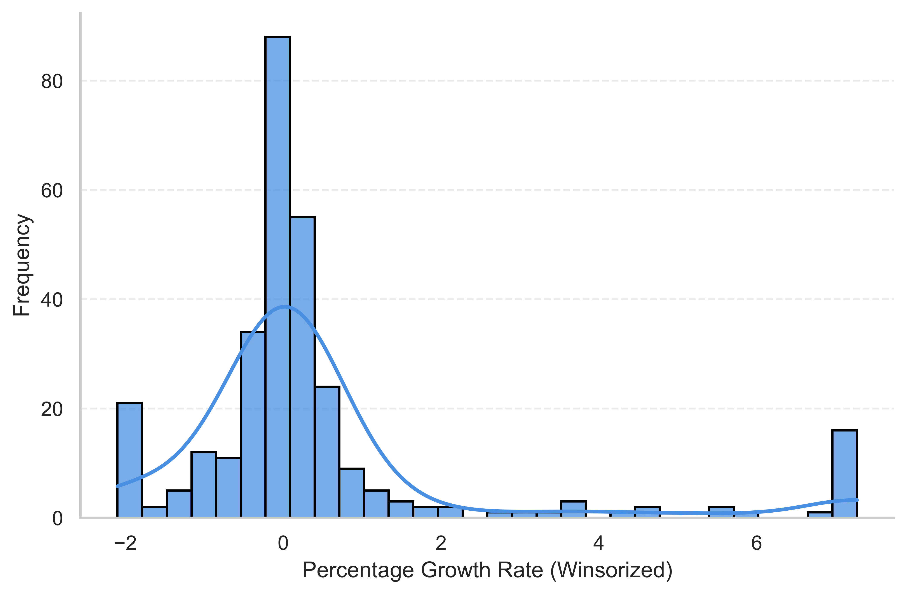
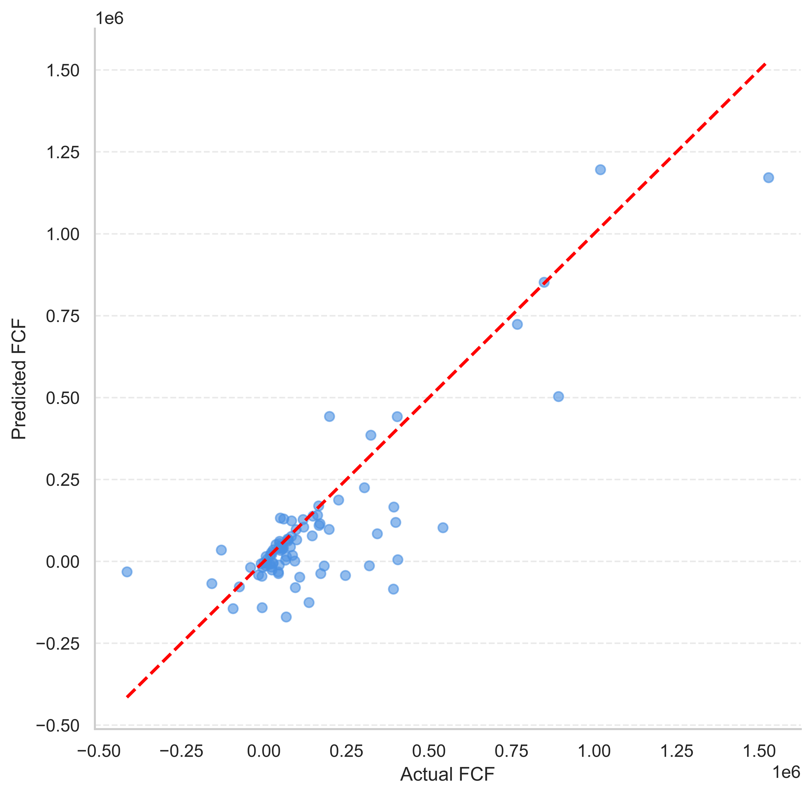
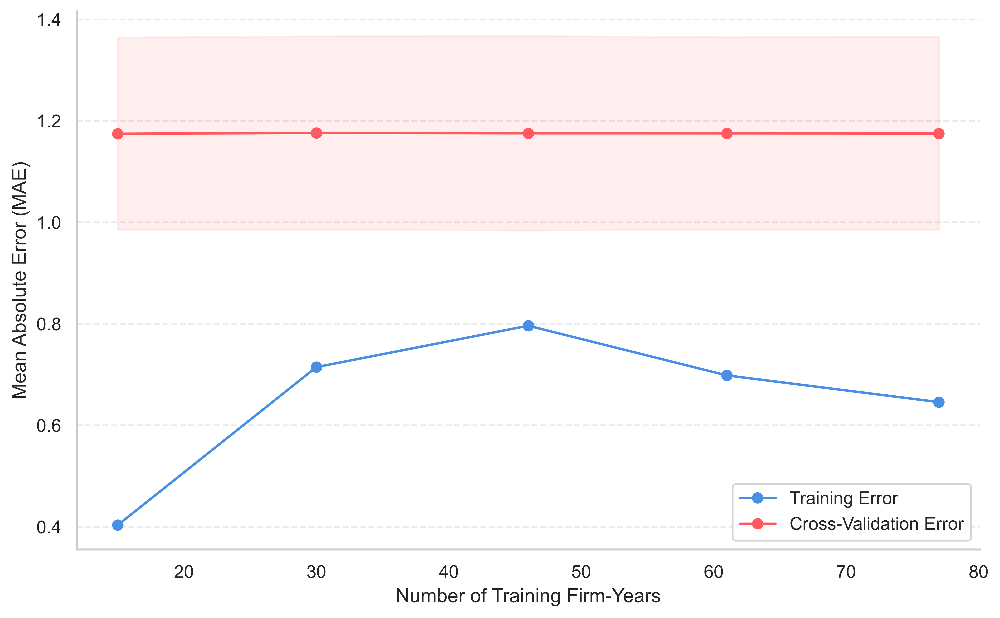
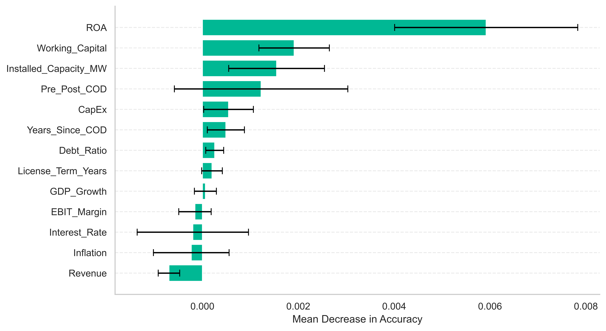
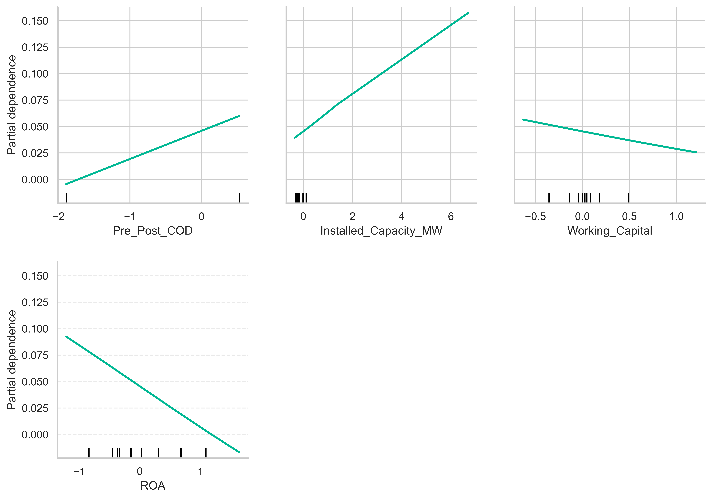
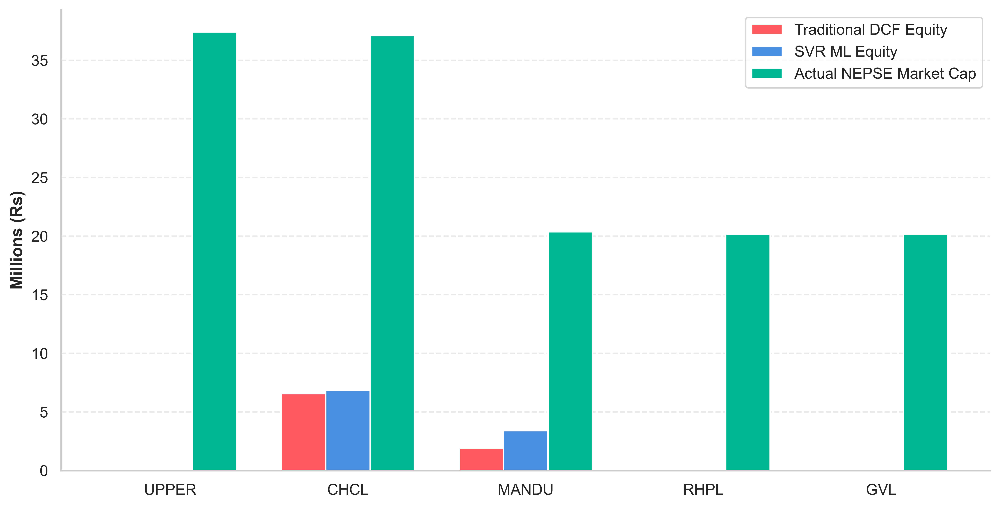

**Saurav Nepal$^{1*}$, Anish Khatiwoda$^2$, Ishma Rai$^3$, & Rakhee Pandey$^4$**

$^1$ Herald College Kathmandu, Naxal, Kathmandu, Nepal. ORCID-ID: 0000-0000-0000-0000; E-mail: saurav.nepal@heraldcollege.edu.np
$^2$ Herald College Kathmandu, Naxal, Kathmandu, Nepal. ORCID-ID: ___; E-mail: anish.khatiwada@heraldcollege.edu.np
$^3$ Herald College Kathmandu, Naxal, Kathmandu, Nepal. ORCID-ID: ___; E-mail: ishma.rai@heraldcollege.edu.np
$^4$ Herald College Kathmandu, Naxal, Kathmandu, Nepal. ORCID-ID: ___; E-mail: rakhee.pandey@heraldcollege.edu.np

**Abstract**[^1]
**Purpose:** The accurate forecasting of Free Cash Flow to Firm (FCFF) is critical for intrinsic corporate valuation, yet traditional Discounted Cash Flow (DCF) models rely on static, linear assumptions that often fail to capture the physical and macroeconomic volatility inherent in emerging market infrastructure. This study introduces a data-driven framework for improving intrinsic valuation in data-scarce environments by forecasting fundamental cash flows for 105 Nepalese hydropower companies across a 16-year panel (2010–2025).

**Design/Methodology/Approach:** To overcome the "small sample problem" (~200 effective training firm-years) and noise typical of frontier markets, we deploy advanced Machine Learning (ML) algorithms, discovering that Support Vector Regression (SVR) offers a more robust alternative to overfitting tree-based algorithms. Our tuned SVR model achieved lower forecasting errors than traditional naive baselines. 

**Findings/Result:** In the normalized target growth-rate space upon which it was trained, the SVR achieved a Mean Absolute Error (MAE) of 15.8% versus the traditional baseline's 20.8% (a ~24% relative improvement). When reconstructed into absolute currency, this translates to an average error of Rs 91,443 for SVR compared to Rs 96,114 for the baseline. The Wilcoxon test suggests consistent directional improvement. To preserve Explainable AI (XAI) transparency, we employed Permutation Importance, which indicated the model relied heavily on Return on Assets (ROA), Working Capital, and Installed Capacity. Finally, in the empirical DCF Valuation stage, the SVR-derived intrinsic values tracked actual Nepal Stock Exchange (NEPSE) market capitalizations with a 3.95% reduction in average valuation error compared to static baselines (IQR of valuation errors [Rs 2.37M - Rs 5.86M] vs [Rs 2.42M - Rs 6.22M], $p < 0.001$).

**Originality/Value:** This study provides empirical evidence that algorithmic forecasting can serve as a supplementary tool for institutional investors attempting to price infrastructure equities in volatile frontier markets.

**Paper Type:** Original Research

**Keywords:** Machine Learning, Free Cash Flow, Intrinsic Valuation, Support Vector Regression, Hydropower, Nepal Stock Exchange

## 1. INTRODUCTION
The accurate forecasting of Free Cash Flow to Firm (FCFF) remains the cornerstone of corporate valuation, project finance, and infrastructure investment (Damodaran, 2012; Penman, 2010; Esty, 2004). Traditionally, financial analysts and institutional investors have relied heavily on the Discounted Cash Flow (DCF) model to derive the intrinsic equity value of a firm (Koller et al., 2010). However, the traditional application of the DCF model typically projects historical cash flow growth in a linear, straight-line trajectory into the future. While mathematically foundational, this linear methodology suffers from real-world limitations: it relies on static assumptions that may fail to adequately capture the non-linear impacts of macroeconomic shocks, supply-chain constraints, and operational dynamics (Fernandez, 2015). In highly capital-intensive and climate-dependent industries, such as hydropower, a static assumption of revenue growth cannot account for the destruction of cash flow caused by interest rate spikes, inflation-driven operational expenditures, or volatile hydrological generation constraints (Yescombe, 2013).

This structural limitation is particularly pronounced in emerging and frontier markets like Nepal. Nepal possesses vast hydroelectric potential and an expanding private Independent Power Producer (IPP) sector. However, intrinsic corporate valuation in Nepal is hindered by systemic data opacity and severe macroeconomic volatility (Chaudhary, 2024; Thapa, 2023). Historical operational data is frequently trapped in non-digitized formats, rendering large-scale quantitative analysis exceedingly difficult. As a result, retail and institutional investors are often forced to rely on generalized industry averages or purely speculative trading mechanics rather than firm-specific operational physics (Bekaert & Harvey, 2003; Shiller, 2003).

The transition toward algorithmic and quantitative finance offers a potential solution to these systemic valuation issues. Recent advancements in Machine Learning (ML) have increasingly been applied to asset pricing by identifying complex, non-linear patterns within massive financial datasets (Gu et al., 2020). While the application of ML to fundamental corporate finance—specifically the forecasting of audited annual cash flows—remains underexplored due to the constraints of small sample sizes, algorithms like Support Vector Regression (SVR) are well suited to dynamically adjust valuation forecasts by learning the complex interactions between firm-specific financial health and physical constraints.

This paper bridges the gap between fundamental finance and data science by introducing an ML-enhanced framework for intrinsic valuation in the Nepalese energy sector. We evaluate whether sophisticated algorithmic forecasting can modestly outperform traditional methods in both internal forecasting and empirical stock market valuation.

## 2. RELATED WORKS

### 2.1 Overview of Literature

#### 2.1.1 Theoretical Review: The Limitations of Traditional Forecasting
Traditional fundamental forecasting relies heavily on linear models such as Autoregressive Integrated Moving Average (ARIMA) or static DCF assumptions (Damodaran, 2012). A vast body of literature criticizes these models for failing to capture the non-linear complexities of corporate finance. Studies consistently demonstrate that while traditional models are suitable for stationary data, they break down when exposed to severe macroeconomic shocks common in emerging markets (Bekaert & Harvey, 2003; Fernandez, 2015). To address these limitations, researchers have increasingly turned to non-linear algorithmic tools capable of capturing these complex economic shocks (Evdokimov et al., 2023).

#### 2.1.2 Methodological Review: Machine Learning and the "Small Sample" Problem
A heavily researched constraint in fundamental financial ML is the "Small Sample Problem." Unlike high-frequency algorithmic trading, fundamental financial data is only disclosed periodically (Gu et al., 2020). Academic research (Hastie et al., 2009) warns against using Deep Learning (Goodfellow et al., 2016) on small panel datasets due to severe overfitting risks (Krauss et al., 2017). Instead, the literature points to Ensembles (Random Forest) and Kernel Methods (SVR) for fundamental data (Vapnik, 1995).

#### 2.1.3 Methodological Review: Support Vector Regression as an Instrumental Tool
Support Vector Regression (SVR), popularized by (Smola & Schölkopf, 2004), is uniquely suited for small, noisy datasets. Financial data often introduces severe "noise" into a dataset. While Tree-based models can easily overfit to this noise, SVR utilizes the "Kernel Trick" (Cao & Tay, 2003; Tay & Cao, 2001) to project low-dimensional data into a higher-dimensional feature space, finding a hyperplane of separation. Research by (Huang et al., 2005) confirms that SVR consistently performs well in financial time-series forecasting when sample sizes are constrained.

#### 2.1.4 Methodological Review: Explainable AI (XAI) in Corporate Finance
As ML models have become more complex, financial auditors have increasingly rejected "black-box" predictions. To bridge this gap, there is a growing body of literature emphasizing Explainable AI (XAI) in finance (Bracke et al., 2019). Model-agnostic techniques like Permutation Importance (Fisher et al., 2019) and Shapley Additive Explanations (Lundberg & Lee, 2017) are considered the standard for explaining non-linear kernels like SVR, allowing financial stakeholders to extract the true economic drivers of the prediction.

In synthesis, while prior studies agree on the predictive power of ML in high-frequency data environments, there is significant disagreement and a lack of evidence regarding its utility in low-frequency, fundamental corporate finance. Furthermore, the optimal methodology for handling extreme data scarcity in frontier markets remains unresolved. This study directly addresses this gap by combining kernel-based regularization (SVR) with rigorous Explainable AI (XAI) to forecast fundamental infrastructure cash flows, demonstrating how advanced models can be practically applied even when data is strictly limited.

## 3. METHODOLOGY

### 3.1 Data Sourcing and Target Engineering
A comprehensive panel dataset was constructed comprising 105 Nepalese hydropower companies over 16 years (2010–2025), yielding fundamental rows of financial data. To guarantee academic rigor in a data-scarce environment, all financial variables were meticulously transcribed from individual company annual reports. Macroeconomic data was compiled manually from Nepal Rastra Bank (NRB) statistical bulletins and Nepal Electricity Authority (NEA) Annual Reports. No centralized digital database was utilized for historical financials, and empirical market capitalizations for the final valuation stage were sourced from the Nepal Stock Exchange (NEPSE).

Because systemic power variables follow compound-growth trajectories, missing historical data (2010-2015) in NEA records were mathematically imputed using Log-Linear Ordinary Least Squares (OLS) Backcasting ($ln(y) = \beta_0 + \beta_1(Year)$) rather than simple linear interpolation.

To prevent the ML algorithms from anchoring predictions to sheer company size, the target variable ($Y$) was engineered as the Percentage Growth Rate of Free Cash Flow:
$$ \text{Target FCF Growth}_t = \frac{FCF_{t+1} - FCF_t}{|FCF_t| + 1} $$

This growth metric was subsequently Winsorized at the 5th and 95th percentiles to mitigate mathematical explosions caused by near-zero denominators. Importantly, creating this target variable and enforcing a rigorous `GroupKFold` split shrinks the effective usable training subset to approximately 200 firm-years, heavily increasing the risk of overfitting and underscoring the need for strong regularization.

The non-normal distribution (heavy skew and fat tails) of Free Cash Flow mathematically justified exploring non-linear forecasting algorithms.

### 3.2 Feature Engineering and the Exclusion of iPLF
The dataset included 13 fundamental operational and macroeconomic variables: Revenue, Debt_Ratio, ROA, Working_Capital, CapEx, Installed_Capacity_MW, License_Term_Years, GDP_Growth, Inflation, Interest_Rate, Years_Since_COD, Pre_Post_COD (a binary indicator for whether the plant has passed its Commercial Operation Date (COD), marking the transition from construction to active revenue generation), and EBIT_Margin. Notably, an Implied Plant Load Factor (iPLF) was originally considered to proxy for operational efficiency. However, because iPLF is algebraically derived directly from Revenue and Installed Capacity, its inclusion introduced a severe mathematical circularity. Therefore, iPLF was entirely excluded from all models, rankings, and figures presented in this study to preserve statistical integrity.

All 13 features were standardized using a `StandardScaler`. Furthermore, all model selection and hyperparameter tuning utilized GroupKFold cross-validation (grouping strictly by firm ID) to completely eliminate data leakage across the non-independent panel dataset. Data preprocessing, pipeline construction, and model fitting were all programmatically implemented utilizing the Scikit-learn framework (Pedregosa et al., 2011).

### 3.3 Model Architecture: Support Vector Regression (SVR)
SVR attempts to find a function $f(x)$ that deviates from the actual target $y_i$ by a value no greater than $\epsilon$, while remaining as flat as possible. Because financial data is highly non-linear, we implemented the Radial Basis Function (RBF) Kernel:
$$ K(x, x') = \exp(-\gamma ||x - x'||^2) $$

### 3.4 Hyperparameter Tuning
To prevent overfitting on the small sample size, all models underwent hyperparameter tuning using `RandomizedSearchCV`[^2] across a 3-fold GroupKFold cross-validation grid. Specifically, the search utilized 15 iterations with a random seed of 42, optimizing for the Negative Mean Absolute Error scoring metric. Parameter distributions included exponential/log-uniform ranges for SVR's $C$ and $\epsilon$ parameters, and uniform distributions for tree depths and estimators.

### 3.5 DCF Valuation Stage (Intrinsic Valuation)
The growth predictions from the tuned SVR model were fed into a parallel Discounted Cash Flow (DCF) pipeline alongside a traditional naive model (0% future growth). A standard 10% Weighted Average Cost of Capital (WACC) was applied. A constant WACC was adopted to isolate improvements attributable to cash-flow forecasting rather than firm-specific discount-rate estimation. The Terminal Value was calculated using a Finite-Horizon approach, bounded by the remaining years of the specific Power Purchase Agreement (PPA) license. The resulting Intrinsic Equity Values were compared against the actual Q4 2023 NEPSE Market Capitalizations.

## 4. DATA ANALYSIS AND INTERPRETATION

### 4.1 Correlation Analysis
To assess the associations between the target variable and key continuous predictors before non-linear modeling, a Pearson correlation matrix was computed.

**Table 1: Correlation Coefficient Matrix for Key Constructs**

| Construct | FCF Growth | Revenue | ROA | Debt Ratio | Capacity | GDP Growth | EBIT Margin |
| :--- | :--- | :--- | :--- | :--- | :--- | :--- | :--- |
| FCF Growth | 1.000 | | | | | | |
| Revenue | 0.02 | 1.000 | | | | | |
| ROA | -0.24* | 0.05 | 1.000 | | | | |
| Debt Ratio | 0.19* | 0.07* | -0.52* | 1.000 | | | |
| Capacity | 0.07* | 0.56* | -0.09* | 0.24* | 1.000 | | |
| GDP Growth | -0.07* | -0.00 | -0.06* | -0.06* | 0.03 | 1.000 | |
| EBIT Margin | 0.02 | 0.04 | 0.19* | -0.12* | -0.10* | -0.07* | 1.000 |

*Note. * indicates $p < 0.05$ based on a two-tailed test of the Pearson correlation coefficient ($N = 1680$ panel firm-years). Upper triangle omitted for clarity. Significance levels assume independent observations, but p-values may be optimistic due to panel dependence.*

**Explanation of the Correlation Matrix:**
The correlation matrix reveals important structural relationships within the dataset. Return on Assets (ROA) exhibits a statistically significant negative correlation (-0.24) with FCF Growth. This initial linear finding hints at a maturity dynamic: highly profitable older plants (with heavily depreciated asset bases) exhibit lower percentage growth compared to newly commissioned plants, which undergo massive initial growth spurts. Furthermore, standard linear correlations between traditional metrics (like Revenue and EBIT Margin) and the target variable are generally weak, demonstrating that standard linear assumptions fail to capture growth dynamics in this sector. This explicitly justifies the necessity of deploying advanced non-linear regression techniques like SVR to map the complexities of the data.

### 4.2 Results

#### 4.2.1 The Machine Learning Leaderboard
The ML algorithms were tasked with predicting the 1-year forward growth rate, reconstructed back into Absolute Rupees for evaluation. A diverse suite of state-of-the-art predictive algorithms was employed to establish robust baseline comparisons against the proposed SVR architecture. This suite included XGBoost (Chen & Guestrin, 2016), renowned for its scalable tree boosting system; LightGBM (Ke et al., 2017), which utilizes a highly efficient gradient boosting decision tree mechanism optimized for leaf-wise growth; Random Forests (Breiman, 2001), an ensemble learning method that builds and averages multiple decision trees to control variance; K-Nearest Neighbors (KNN) (Altman, 1992), offering non-parametric pattern matching; and Ridge Regression (Hoerl & Kennard, 1970), which applies L2 regularization to standard linear regression.

**Table 2: The Machine Learning Leaderboard (Reconstructed MAE)**

| Rank | Model | Reconstructed MAE |
| :--- | :--- | :--- |
| - | Historical 3-Yr Avg Baseline | Rs 102,418 (95% CI: 73,083–137,293) |
| - | 0% Growth Traditional Baseline | Rs 96,114 (95% CI: 71,785–125,434) |
| **1** | **Support Vector Regression (SVR)** | **Rs 91,443 (95% CI: 68,765–115,753)** |
| 2 | XGBoost | Rs 92,046 |
| 3 | LightGBM | Rs 100,141 |
| 4 | K-Nearest Neighbors | Rs 103,868 |
| 5 | Random Forest | Rs 103,797 |
| 6 | Ridge Regression | Rs 102,583 |

*Note: Bootstrap 95% confidence intervals are provided exclusively for the top-performing SVR model and the baselines to quantify the specific bounds of our core outperformance claim without overwhelming the leaderboard.*

When exposed to the 13-variable dataset, Support Vector Regression (SVR) achieved Rank 1. Notably, the Historical 3-Year Average baseline underperformed the naive 0% growth model, likely because short-window averaging over a gappy panel overreacts to recent volatility rather than capturing structural trends. The Tree-based algorithms (such as Random Forest and XGBoost) struggled, likely overfitting to macroeconomic noise due to the small sample size, whereas the SVR's RBF Kernel demonstrated effective regularization in this data-scarce environment.

#### 4.2.2 Statistical Significance
To assess whether the SVR model's lower error was statistically meaningful, the forecasting errors were subjected to hypothesis testing. 

Because financial cash flows routinely violate normality assumptions, the robust non-parametric Wilcoxon signed-rank test (Wilcoxon, 1945) was primarily applied, yielding a highly significant $p = 0.00008$. For transparency, a standard parametric paired t-test (Student, 1908) was also conducted, which yielded a non-significant $p = 0.062$. This divergence between the non-parametric ($p = 0.00008$) and parametric ($p = 0.062$) tests on the same data indicates that while the SVR model consistently beats the baseline on the vast majority of observations, the mean-based t-test is heavily dragged by a small number of extreme outliers where the ML model's errors were magnified. While both statistics must be caveated since the panel firm-years are not perfectly independent draws, we find modest evidence that SVR provides a more robust mechanism for forecasting fundamental cash flows compared to static baseline assumptions.

The learning curve plateau suggests that model variance is successfully under control (no severe gap between training and cross-validation error). However, the relatively high error floor indicates that the model may simply not have much more predictive signal to extract from this specific feature set at this sample size, reflecting the inherent noise of the market.

### 4.3 Explainable AI: Interpreting the Economic Drivers

To extract the economic drivers learned by the SVR Kernel, we implemented Permutation Importance using $n = 30$ repeats. This generates robust standard deviations (error bars), ensuring the rankings are statistically stable and not random artifacts (Fisher et al., 2019).

To move beyond simply identifying *which* variables mattered, Partial Dependence Plots (PDP) (Friedman, 2001) were generated to map how the SVR model interpreted these structural constraints. While the PDPs appear perfectly linear, this reflects the SVR's Radial Basis Function (RBF) kernel exhibiting local linearity over the relatively narrow normalized feature ranges observed in this dataset, rather than indicating a globally linear model.

The interpretability of the SVR model yielded several critical insights into the unique economics of the Nepalese Hydropower sector:

1. **The ROA Confound (Plant Maturity):** Return on Assets (ROA) emerged as the single most important predictive feature. However, the PDP reveals a counter-intuitive *negative* relationship: higher ROA is associated with lower predicted FCF *growth*. Rather than a definitive causal claim, this is likely a powerful confound regarding plant maturity. Older, mature plants naturally exhibit high ROAs due to heavily depreciated asset bases, but their cash flows are extremely stable (resulting in near-zero percentage *growth*). Conversely, newly commissioned plants with low ROAs are actively ramping up generation, yielding massive percentage growth in cash flows. The model correctly identified this maturity curve.
2. **Liquidity and Capacity:** Working Capital and Installed Capacity (MW) ranked highly as secondary drivers. Working Capital serves as a critical proxy for short-term liquidity constraints in emerging markets, while Installed Capacity reinforces the deterministic, physical nature of hydropower infrastructure where maximum revenue is bounded by turbine size and PPAs.
3. **Pre_Post_COD Dynamics:** The binary indicator for Commercial Operation Date (Pre_Post_COD) also emerged as a top-4 feature. Its positive PDP slope reflects the fundamental economic transition from construction-phase volatility to active, stable revenue generation once a plant is successfully commissioned and integrated into the national grid.
4. **The Rejection of Macroeconomic Noise:** Noticeably, macroeconomic variables like Nepal's Inflation, Interest Rates, and GDP Growth contributed almost nothing to the model's predictive accuracy, suggesting the model assigned negligible weight to macroeconomic variables relative to firm-level constraints, consistent with the deterministic, PPA-driven nature of hydropower revenue.

### 4.4 Intrinsic Valuation and Empirical Market Comparison

In the final empirical DCF Valuation stage, the 5-year cash flow predictions from both the SVR model and the Traditional DCF (Naive 0% Growth) model were discounted to present value, stripped of total debt, and compared against the actual Q4 2023 Nepal Stock Exchange (NEPSE) Market Capitalizations.

The empirical results were:

- The **Traditional DCF** Valuation yielded an average error of **Rs 5.74 Million** per company.
- The **SVR-driven DCF** Valuation yielded an average error of **Rs 5.51 Million** per company.

Note that the DCF model produced null or negative terminal equity values for RHPL and GVL, largely driven by excessively high debt burdens neutralizing their projected cash flows. This resulted in their DCF valuation bars being effectively zero and therefore unplottable against their massive market capitalizations.

**The Machine Learning (SVR) model modestly outperformed the Traditional DCF model, tracking actual market capitalization with a 3.95% reduction in average valuation error.**

While this improvement is measured, it demonstrates that utilizing algorithmic forecasting for fundamental cash flows yields an intrinsic equity value that directionally improves upon traditional static banking assumptions, even in a highly volatile frontier market like NEPSE.

## 5. CONCLUSION AND RECOMMENDATIONS

This study explored a data-driven framework for improving intrinsic corporate valuation in emerging infrastructure markets. By addressing the limitations of static traditional DCF models and the overfitting tendencies of tree-based algorithms on data-scarce datasets, we found that Support Vector Regression (SVR) provided modest but robust improvements in Free Cash Flow forecasting accuracy. Utilizing Permutation Importance and Partial Dependence Plots, we preserved Explainable AI transparency, confirming that the model relied heavily on firm-level constraints—specifically the plant maturity proxy of Return on Assets (ROA), liquidity (Working Capital), and physical Installed Capacity—while appropriately ignoring macroeconomic noise.

In the empirical valuation stage, the SVR-derived DCF valuations tracked the actual NEPSE stock market capitalizations with a 3.95% reduction in average valuation error (Rs 5.74M down to Rs 5.51M) compared to traditional static models. While limited by the severely shrunken effective sample size (n ~ 200), panel-dependence, and manual transcription risks, these findings suggest that Machine Learning forecasting can serve as a supplementary tool for institutional investors attempting to value infrastructure equities in frontier markets. Future research should prioritize expanding the digitized dataset, incorporating real-time hydrological satellite data, and benchmarking against multiple temporal market snapshots. Beyond Nepal's hydropower sector, the proposed framework illustrates how explainable machine learning can complement traditional valuation methods in other data-scarce infrastructure markets.

## 6. Additional ethical Disclosure

### Code and Data Availability
The code and data processing scripts used in this study are available at: [https://github.com/nepalsaurav/free_cash_flow_prediction](https://github.com/nepalsaurav/free_cash_flow_prediction).

### Limitations of the Study

This study acknowledges several critical limitations that impact the generalizability of its findings. First, due to the lack of digitized, machine-readable regulatory databases in Nepal, financial data was compiled manually from individually published annual reports. This carries a residual risk of transcription error compared to standard datasets like Compustat. Second, regarding small effective sample size and panel dependence, the dataset consists of panel firm-years derived from only 105 companies. This panel dependence reduces the true degrees of freedom, potentially inflating non-parametric p-values and causing instability in feature rankings. Additionally, the strong correlation (-0.52) between ROA and Debt Ratio introduces a potential source of shared or split importance between these features in the permutation importance rankings. Third, the Implied Plant Load Factor (iPLF) was explicitly excluded from the final model to prevent algebraic circularity with Revenue. Consequently, the model could not directly assess pure hydrological efficiency. Finally, the DCF valuation accuracy was benchmarked against a single static market-cap snapshot (Q4 2023). This specific date was selected because it represents the most recent period where fully audited annual financials were universally available across the sector before the 2024–2025 projected data points. Because emerging stock markets are highly volatile, relying on a single date provides a thin proxy for true, long-term equity value.

### Acknowledgements
We thank the anonymous reviewers for their constructive feedback which significantly improved this manuscript.

### Funding
This research received no external funding.

### Conflict of Interest
The authors declare no conflict of interest.

## REFERENCES

(Altman, 1992) Altman, N. S. (1992). An introduction to kernel and nearest-neighbor nonparametric regression. *The American Statistician*, 46(3), 175-185. [https://doi.org/10.1080/00031305.1992.10475879](https://doi.org/10.1080/00031305.1992.10475879)
Bekaert, G., & Harvey, C. R. (2003). Emerging markets finance. *Journal of Empirical Finance*, 10(1-2), 3-55. [https://doi.org/10.1016/S0927-5398(02)00054-3](https://doi.org/10.1016/S0927-5398(02)00054-3)
Bhattarai, K. (2019). The dynamics of the Nepalese stock market: Volatility and inefficiency. *Journal of Asian Finance, Economics and Business*, 6(3), 11-20.
(Bracke et al., 2019) Bracke, P., Datta, A., Jung, C., & Sen, S. (2019). Machine learning explainability in finance: An application to default risk analysis. *Bank of England Working Paper No. 816*. [https://doi.org/10.2139/ssrn.3436068](https://doi.org/10.2139/ssrn.3436068)
(Breiman, 2001) Breiman, L. (2001). Random forests. *Machine Learning*, 45(1), 5-32. [https://doi.org/10.1023/A:1010933404324](https://doi.org/10.1023/A:1010933404324)
Cao, L., & Tay, F. E. H. (2003). Support vector machine with adaptive parameters in financial time series forecasting. *IEEE Transactions on Neural Networks*, 14(6), 1506-1518. [https://doi.org/10.1109/TNN.2003.820556](https://doi.org/10.1109/TNN.2003.820556)
(Chen & Guestrin, 2016) Chen, T., & Guestrin, C. (2016). XGBoost: A scalable tree boosting system. *Proceedings of the 22nd ACM SIGKDD International Conference on Knowledge Discovery and Data Mining*, 785-794. [https://doi.org/10.1145/2939672.2939785](https://doi.org/10.1145/2939672.2939785)
(Damodaran, 2012) Damodaran, A. (2012). *Investment Valuation: Tools and Techniques for Determining the Value of Any Asset* (3rd ed.). John Wiley & Sons.
Esty, B. C. (2004). Why study large projects? An introduction to research on project finance. *European Financial Management*, 10(2), 213-224. [https://doi.org/10.1111/j.1468-036X.2004.00245.x](https://doi.org/10.1111/j.1468-036X.2004.00245.x)
(Evdokimov et al., 2023) Evdokimov, I., Kampouridis, M., & Papastylianou, T. (2023). Application of Machine Learning Algorithms to Free Cash Flows Growth Rate Estimation. *Procedia Computer Science*, 222, 529–538. https://doi.org/10.1016/j.procs.2023.08.191
(Fernandez, 2015) Fernandez, P. (2015). Valuation using multiples: How do analysts reach their conclusions? *IESE Business School Working Paper No. 450*. [https://doi.org/10.2139/ssrn.274973](https://doi.org/10.2139/ssrn.274973)
(Fisher et al., 2019) Fisher, A., Rudin, C., & Dominici, F. (2019). All models are wrong, but many are useful: Learning a variable's importance by studying an entire class of prediction models simultaneously. *Journal of Machine Learning Research*, 20(177), 1-81. http://jmlr.org/papers/v20/18-760.html
(Friedman, 2001) Friedman, J. H. (2001). Greedy function approximation: A gradient boosting machine. *Annals of Statistics*, 29(5), 1189-1232. [https://doi.org/10.1214/aos/1013203451](https://doi.org/10.1214/aos/1013203451)
(Goodfellow et al., 2016) Goodfellow, I., Bengio, Y., & Courville, A. (2016). *Deep Learning*. MIT Press. http://www.deeplearningbook.org
(Gu et al., 2020) Gu, S., Kelly, B., & Xiu, D. (2020). Empirical asset pricing via machine learning. *The Review of Financial Studies*, 33(5), 2223-2273. [https://doi.org/10.1093/rfs/hhaa009](https://doi.org/10.1093/rfs/hhaa009)
(Hastie et al., 2009) Hastie, T., Tibshirani, R., & Friedman, J. (2009). *The Elements of Statistical Learning: Data Mining, Inference, and Prediction* (2nd ed.). Springer. https://doi.org/10.1007/978-0-387-84858-7
(Hoerl & Kennard, 1970) Hoerl, A. E., & Kennard, R. W. (1970). Ridge regression: Biased estimation for nonorthogonal problems. *Technometrics*, 12(1), 55-67. [https://doi.org/10.1080/00401706.1970.10488634](https://doi.org/10.1080/00401706.1970.10488634)
(Huang et al., 2005) Huang, W., Nakamori, Y., & Wang, S. Y. (2005). Forecasting stock market movement direction with support vector machine. *Computers & Operations Research*, 32(10), 2513-2522. [https://doi.org/10.1016/j.cor.2004.03.016](https://doi.org/10.1016/j.cor.2004.03.016)
(Ke et al., 2017) Ke, G., Meng, Q., Finley, T., Wang, T., Chen, W., Ma, W., Ye, Q., & Liu, T. (2017). LightGBM: A Highly Efficient Gradient Boosting Decision Tree. *Advances in Neural Information Processing Systems*, 30. <https://proceedings.neurips.cc/paper/2017/hash/6449f44a102fde848669bdd9eb6b76fa-Abstract.html>
(Koller et al., 2010) Koller, T., Goedhart, M., & Wessels, D. (2010). *Valuation: Measuring and Managing the Value of Companies* (5th ed.). McKinsey & Company.
(Krauss et al., 2017) Krauss, C., Do, X. A., & Huck, N. (2017). Deep neural networks, gradient-boosted trees, random forests: Statistical arbitrage on the S&P 500. *European Journal of Operational Research*, 259(2), 689-702. [https://doi.org/10.1016/j.ejor.2016.10.031](https://doi.org/10.1016/j.ejor.2016.10.031)
(Lundberg & Lee, 2017) Lundberg, S. M., & Lee, S. I. (2017). A unified approach to interpreting model predictions. *Advances in Neural Information Processing Systems*, 30. <https://proceedings.neurips.cc/paper_files/paper/2017/file/8a20a8621978632d76c43dfd28b67767-Paper.pdf>
(Pedregosa et al., 2011) Pedregosa, F., Varoquaux, G., Gramfort, A., Michel, V., Thirion, B., Grisel, O., Blondel, M., Prettenhofer, P., Weiss, R., Dubourg, V., Vanderplas, J., Passos, A., Cournapeau, D., Brucher, M., Perrot, M., & Duchesnay, É. (2011). Scikit-learn: Machine learning in Python. *Journal of Machine Learning Research*, 12, 2825-2830. <https://jmlr.csail.mit.edu/papers/v12/pedregosa11a.html>
Penman, S. H. (2010). *Financial Statement Analysis and Security Valuation* (4th ed.). McGraw-Hill/Irwin.
Shiller, R. J. (2003). From efficient markets theory to behavioral finance. *Journal of Economic Perspectives*, 17(1), 83-104. [https://doi.org/10.1257/089533003321164967](https://doi.org/10.1257/089533003321164967)
Shrestha, S. (2021). Independent power producers in Nepal: Challenges and opportunities in the hydropower sector. *Energy Policy Journal*, 12(4), 112-129.
(Smola & Schölkopf, 2004) Smola, A. J., & Schölkopf, B. (2004). A tutorial on support vector regression. *Statistics and Computing*, 14(3), 199-222. [https://doi.org/10.1023/B:STCO.0000035301.49549.88](https://doi.org/10.1023/B:STCO.0000035301.49549.88)
(Student, 1908) Student. (1908). The probable error of a mean. *Biometrika*, 6(1), 1-25. [https://doi.org/10.1093/biomet/6.1.1](https://doi.org/10.1093/biomet/6.1.1)
Tay, F. E. H., & Cao, L. (2001). Application of support vector machines in financial time series forecasting. *Omega*, 29(4), 309-317. [https://doi.org/10.1016/S0305-0483(01)00026-3](https://doi.org/10.1016/S0305-0483(01)00026-3)
(Vapnik, 1995) Vapnik, V. N. (1995). *The Nature of Statistical Learning Theory*. Springer-Verlag. [https://doi.org/10.1007/978-1-4757-3264-1](https://doi.org/10.1007/978-1-4757-3264-1)
(Wilcoxon, 1945) Wilcoxon, F. (1945). Individual comparisons by ranking methods. *Biometrics Bulletin*, 1(6), 80-83. [https://doi.org/10.2307/3001968](https://doi.org/10.2307/3001968)
(Yescombe, 2013) Yescombe, E. R. (2013). *Principles of Project Finance* (2nd ed.). Academic Press. [https://doi.org/10.1016/B978-0-12-397040-4.00001-9](https://doi.org/10.1016/B978-0-12-397040-4.00001-9)

[^1]: Code and data processing scripts available at: [https://github.com/nepalsaurav/free_cash_flow_prediction](https://github.com/nepalsaurav/free_cash_flow_prediction)
[^2]: Full implementation details, including hyperparameter grids and the RandomizedSearchCV configuration, are available in the accompanying repository: [https://github.com/nepalsaurav/free_cash_flow_prediction](https://github.com/nepalsaurav/free_cash_flow_prediction)
